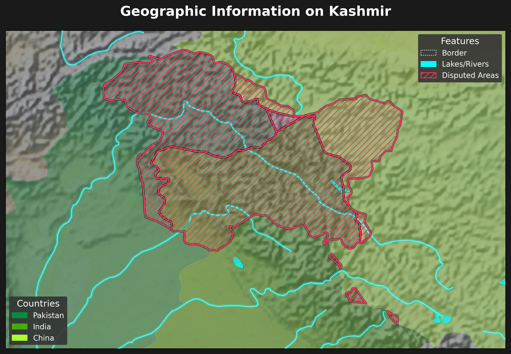

# 30DayMapChallenge Day22

Day22のテーマが`Data challenge: Natural Earth`ということで、Natural Earthからダウンロードしたデータを使用してカシミール地方を可視化してみました。ラスター形式の起伏データと、国境、河川、湖、紛争地帯のshpデータを組み合わせています。スタイリングは `main.py` 、マップのパラメータ（範囲、凡例の色、出力パス）は `config/config.json` で管理しており、他の場所をマッピングしたい場合にも柔軟に対応できるようにしてみました。

## 必須要件
- Python 3.13 (プロジェクト管理には `uv` を使用)
- `pyproject.toml` に記載された依存関係 (`geopandas`, `matplotlib`, `rasterio` など)
- `data/` 配下に配置され、以下の環境変数経由で参照される Natural Earth データセット:
    - `PATH_COUNTRIES`
    - `PATH_DISPUTED`
    - `PATH_LAKES`
    - `PATH_RIVERS`
    - `PATH_RASTER`

`create_map.sh` は、データが `./data/...` 配下にあると仮定してこれらの変数をエクスポートします。shpファイルを別の場所に保存している場合は、パスを調整してください。

## 設定
`config/config.json` には複数のマップ定義を保持できます。指定できるフィールドは以下のようになっています。:
- `fig_size`, `xlim`, `ylim`, `xticks`, `yticks`: 図のレイアウト設定
- `countries`: 国レイヤーから描画される名前と色のペア
- `output`: 保存される図の相対パス

配列にオブジェクトを追加することで、バリエーション（異なる範囲、パレット、タイトルなど）を一括生成できます。

## 使用方法
1. 依存関係のインストール: `uv sync`または`uv add`で1つずつ追加
2. Natural Earthのファイルが存在することを確認し、必要であれば `create_map.sh` を調整
3. マップの生成:
     ```bash
     ./create_map.sh
     ```
     （または、同じ変数を手動でエクスポートした後に `uv run main.py` を実行）

出力結果は、各設定エントリで指定された `img/` ディレクトリに書き込まれます。

## 結果
何も変更せずに`create_map.sh`を実行すると、以下のような地図が出力されます。
パキスタンに流れ込んでいる河川は、インド及び中国を水源としており、この3国間で紛争が起きている理由を理解する一助になるかと思い作成してみました。

