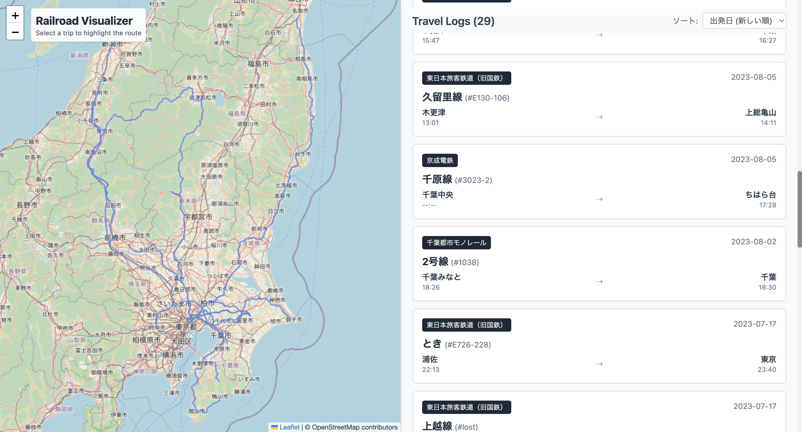

# 30DayMapChallenge Day30

Day30 のテーマが`Makeover`ということでしたので、Day26 でチャレンジしようとして時間が足りなかった`自分の旅行記録のマッピング`にチャンレジしました。AI に力を借りつつではありますが、それなりのものができたと思います。

## 設定

環境変数として、

- `VITE_OSM_TILE_URL`
- `VITE_RAILROAD_DATA_URL`

を設定してください。サンプル画像では OSM のラスタータイルデータを利用しています。路線データは自前で用意したデータを使用しています。
サンプルでは、`Bun`をランタイムとして使用しています。

## サンプル

